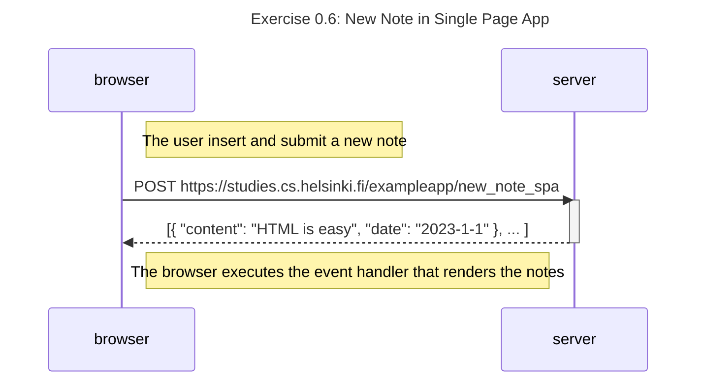

```mermaid
sequenceDiagram
    title Exercise 0.6: New Note in Single Page App

    participant browser
    participant server

    Note right of browser: The user insert and submit a new note

    browser->>server: POST https://studies.cs.helsinki.fi/exampleapp/new_note_spa
    activate server
    server-->>browser: [{ "content": "HTML is easy", "date": "2023-1-1" }, ... ]
    deactivate server

    Note right of browser: The browser executes the event handler that renders the notes
```